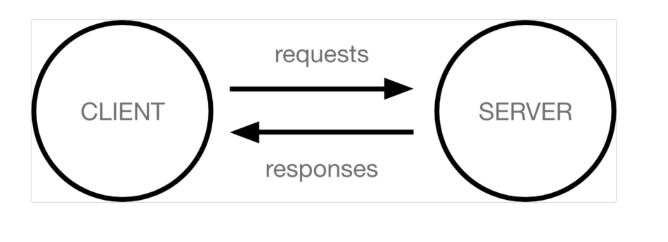
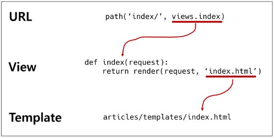

# Django

## INDEX

1. Django 시작하기
2. 클라이언트와 서버
3. Django 무작정 따라하기
4. 가상환경
5. 프로젝트와 앱
6. 요청과 응답
------------------
## Django 시작하기

**웹 서비스 개발**에는 무엇이 필요할까?
 - 로그인, 회원관리, 데이터베이스, 서버 등등...
 - 너무 많은 기술이 필요하다
 - 모든 걸 직접 만들 필요 없음!!
 - 잘 만든어진 것들을 가져다가 좋은 환경에서 잘 쓰기만 하면 되는 세상

### Framework 이해하기
 - 프레임워크 : 서비스 개발에 필요한 기능들을 미리 구현해서 모아 놓은 것
 - Framework를 잘 사용하기만 하면 웹 서비스 개발에 있어서 모든 것들을 하나부터 열까지 직접 개발할 필요 없이, 내가 만들고자 하는 본질(로직)에 집중해 개발할 수 있음
 - 소프트웨어의 생산성과 품질을 높임

### Django를 배워야하는 이유
1. Python으로 작성된 프레임워크
  - Python이라는 언어의 강력함과 거대한 커뮤니티
2. 수많은 여러 유용한 기능들
3. 검증된 웹 프레임워크
  - 화해, Toss, 두나무, 당근마켓, 요기요 등
  - 유명한 많은 서비스들이 사용한다는 것 = 안정적으로 서비스를 할 수 있다는 검증
--------------
## 클라이언트와 서버

### 클라이언트-서버 구조
- 오늘날 우리가 사용하는 대부분의 웹 서비스는 클라이언트-서버 구조를 기반으로 동작
- 클라이언트와 서버 역시 하나의 컴퓨터이며 이들이 어떻게 상호작용하는지에 대한 간소화된 다이어그램은 다음과 같음



클라이언트
- 웹 사용자의 인터넷에 연결된 장치(ex : wi-fi에 연결된 컴퓨터 또는 모바일)
- chrome 또는 Firefox와 같은 웹 브라우저
- 서비스를 요청하는 주체

서버
- 웹 페이지, 사이트 또는 앱을 저장하는 컴퓨터
- 클라이언트가 웹 페이지에 접근하려고 할 때 서버에서 클라이언트 컴퓨터로 웹 페이지 데이터를 응답해 사용자의 웹 브라우저에 표시됨
- 요청에 대해 서비스를 응답하는 주체

상호작용 예시
- 예를 들어, 우리가 Google 홈페이지에 접속하는 과정을 알아보자
1. 결론적으로 인터넷에 연결된 전세계 어딘가에 있는 구글 컴퓨터에게 'Google 홈페이지.html'파일을 달라고 요청하는 것
2. 그러면 구글 컴퓨터는 우리의 요청을 받고 'Google 홈페이지.html'파일을 인터넷을 통해서 우리 컴퓨터에게 응답해줌
3. 그렇게 전달받은 'Google 홈페이지.html'파일을 웹 브라우저가 우리가 볼 수 있도록 해석해주는 것

- 클라이언트 : 'Google 홈페이지.html'을 달라고 요청한 컴퓨터, 웹 브라우저
- 서버 : 'Google 홈페이지.html'파일을 제공한 컴퓨터, 프로그램
- 즉, 어떠한 자원을 달라고 요청하는 쪽을 클라이언트, 자원을 제공해주는 쪽을 서버라고 한다.

### 정리
- 우리가 사용하는 웹은 클라이언트-서버 구조로 이루어져 있음
- 앞으로 우리가 배우는 것도 이 클라이언트-서버 구조를 만드는 방법을 배우는 것
- 이 중에서 Django는 서버를 구현하는 웹 프레임워크
-----------------
## Django 무작정 따라하기

1. 설치

    ```$ pip install django==3.2.18```

2. 프로젝트 생성
   
    ```$ django-admin startproject firstpjt```

3. 서버 실행

    ```$ python manage.py runserver```

4. 서버 실행 후 메인 페이지 확인
------------------
## 가상환경

### 가상환경 사용하기

- 가상환경 생성
  
    ```python -m venv venv```

- 가상환경 활성화

    ```source venv/Scripts/activate```

- 가상환경 비활성화

    ```deactivate```

가상환경은 프로젝트별 패키지를 독립적으로 관리하기 위한 것

내 프로젝트를 다른 사람이 실행하려면?

모든 패키지를 다 설치해야 한다!

가상환경 패키지 목록 저장
```
pip freeze > requirements.txt
```

파일로부터 패키지 설치
```
pip install -r requirements.txt
```

------------------
## 프로젝트와 앱
### 프로젝트 구조
- __init\_\_.py
  - python에게 이 디렉토리를 하나의 python 패키지로 다루도록 지시
  - 별도로 추가 코드를 작성하지 않음
- asgi.py
  - Asynchronous Server Gateway Interface
  - Django 애플리케이션이 비동기식 웹 서버와 연결 및 소통하는 것을 도움
  - 추후 배포시에 사용하며 지금은 수정하지 않음
- settings.py
  - Django 프로젝트 설정을 관리
- urls.py
  - 사이트의 url과 적절한 views의 연결을 지정
- wsgi.py
  - Web Server Gateway Interface
  - Django 애플리케이션이 웹서버와 연결 및 소통하는 것을 도움
  - 추후 배포 시에 사용하며 지금은 수정하지 않음
- manage.py
  - Django 프로젝트와 다양한 방법으로 상호작용 하는 커맨드라인 유틸리티
    ```
    $ python manage.py <command> [options]
    ```

### Django Application
- 애플리케이션(앱) 생성
    ```
    $ python manage.py startapp articles
    # 일반적으로 애플리케이션 이름은 '복수형'으로 작성하는 것을 권장
    ```

    앱(App) = 하나의 큰 기능 단위
    
    정해진 규칙은 없으며 개발자가 판단해서 앱 생성

    여러 개의 앱이 아닌 단일 앱으로 개발해도 괜찮음

### 애플리케이션 구조
- admin.py
  - 관리자용 페이지를 설정 하는 곳
- apps.py
  - 앱의 정보가 작성된 곳
  - 별도로 추가 코드를 작성하지 않음
- models.py
  - 애플리케이션에서 사용하는 Model을 정의하는 곳
  - MTV 패턴의 M에 해당
- tests.py
  - 프로젝트의 테스트 코드를 작성하는 곳
- views.py
  - view 함수들이 정의 되는 곳
  - MTV 패턴의 V에 해당

### 애플리케이션 등록
- 앱을 사용하기 위해서는 반드시 INSTALLED_APPS 리스트에 반드시 추가해야함!! **매우중요!!**

    ```python
    # settings.py

    INSTALLED_APPS = [
      'articles',
      'django.contrib.admin',
      'django.contrib.auth',
      'django.contrib.contenttypes',
      'django.contrib.sessions',
      'django.contrib.messages',
      'django.contrib.staticfiles',
    ]
    ```

### Project & Application
- Project
  - "collection of apps"
  - 프로젝트는 앱의 집합
  - 프로젝트에는 여러 앱이 포함될 수 있음
  - 앱은 여러 프로젝트에 있을 수 있음
- Application
  - 앱은 실제 요청을 처리하고 페이지를 보여주는 등의 역할을 담당
  - 앱은 하나의 역할 및 기능 단위로 작성하는 것을 권장함


## 요청과 응답

Django의 세가지 구조

MTV
- Model(data)
- View(logic)
- Template(html)


URL > VIEW > TEMPALTE 데이터 흐름 이해하기
### URLs
```python
# urls.py
from django.contrib import admin
from django.urls import path
from articles import views

urlpatterns = [
  path('admin/', admin.site.urls),
  path('articles/', views.index),
]
# 마지막에 '/' 꼭 붙여주기
```

### View
```python
# views.py
from django.shortcuts import render
from django.http import HttpResponse

def index(request):
  return HttpResponse("<h1>hello</h1>")
```
요청이 들어오면 HTML Page로 응답을 돌려준다.

### Templates
```python
# 템플릿 폴더 이름은 반드시 templates라고 지정해야 함
# app_name/templates/app_name 위치에 생성!
```

- 실제 내용을 보여주는데 사용되는 파일
- 파일의 구조나 레이아웃을 정의
- Template 파일의 기본 경로
  - app 폴더 안의 templates 폴더
  - app_name/templates/app_name

### render()
```python
render(request, template_name, context)
```
- 주어진 템플릿을 주어진 컨텍스트 데이터와 결합하고 렌더링 된 텍스트와 함께 HttpResponse(응답) 객체를 반환하는 함수
  1. request
      - 응답을 생성하는 데 사용되는 요청 객체
  2. template_name
      - 템플릿의 전체 이름 또는 템플릿 이름의 경로
  3. context
      - 템플릿에서 사용할 데이터 (딕셔너리 타입으로 작성)

### 코드 작성순서
- 앞으로 Django에서의 코드 작성은 URL > View > Template 순으로 작성
- 데이터의 흐름 순서

    