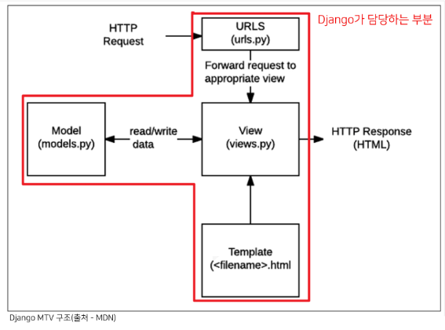

# Django

## INDEX
- Django 구조 이해하기(MTV Design Pattern)
- Django Template Language
- Template Inheritance
- Django URLs

---------------
## Django 구조 이해하기(MTV Design Pattern)
### Design Pattern

 자주 사용되는 구조가 있다는 것을 알게 되고 이를 일반화해서 하나의 공법으로 만들어 둔것

소프트웨어 디자인 패턴

다수의 엔지니어들이 일반화된 패턴으로 소프트웨어 개발을 할 수 있도록 한 규칙, 커뮤니케이션의 효율성을 높이는 기법
- 소프트웨어도 수십년간 전 세계의 개발자들이 계속 만들다 보니 자주 사용되는 구조와 해결책이 있다는 것을 알게 됨
- 클라이언트-서버 구조도 소프트웨어 디자인 패턴 중 하나
- 자주 사용되는 소프트웨어의 구조를 소수의 뛰어난 엔지니어가 마치 건축의 공법처럼 일반적인 구조화를 해둔 것

소프트웨어 디자인 패턴의 목적
- 특정 문맥에서 공통적으로 발생하는 문제에 대해 재사용 가능한 해결책을 제시
- 프로그래머가 어플리케이션이나 시스템을 디자인할 때 발생하는 공통된 문제들을 해결하는데 형식화 된 가장 좋은 관행

소프트웨어 디자인 패턴의 장점
- 디자인패턴을 알고 있다면 서로 복잡한 커뮤니케이션이 매우 간단해짐

### Django's Design Pattern

Django에서의 디자인 패턴
- Django에 적용된 디자인 패턴은 MTV 패턴이다.
- MTV 패턴은 MVC 디자인 패턴을 기반으로 조금 변형된 패턴이다.

MVC 소프트웨어 디자인 패턴의 목적
- 관심사 분리
- 더 나은 업무의 분리와 향상된 관리를 제공
- 각 부분을 독립적으로 개발할 수 있어, 하나를 수정하고 싶을 때 모두 건들지 않아도 됨
  - 개발 효율성 및 유지보수가 쉬워짐
  - 다수의 멤버로 개발하기 용이함

### MTV 디자인패턴
- Model
  - MVC패턴에서 Model의 역할에 해당
  - 데이터와 관련된 로직을 관리
  - 응용프로그램의 데이터 구조를 정의하고 데이터베이스의 기록을 관리
- Template
  - 레이아웃과 화면을 처리
  - 화면상의 사용자 인터페이스 구조와 레이아웃을 정의
  - MVC패턴에서 View의 역할에 해당
- View
  - Model & Template과 관련한 로직을 처리해서 응답을 반환
  - 클라이언트의 요청에 대해 처리를 분기하는 역할
  - 동작 예시
    - 데이터가 필요하다면 model에 접근해서 데이터를 가져오고 가져온 데이터를 template로 보내 화면을 구성하고 구성된 화면을 응답으로 만들어 클라이언트에게 반환
  - MVC패턴에서 Controller의 역할에 해당
  
  

정리
- Django는 MTV 디자인 패턴을 가지고 있음
  - Model : 데이터 관련
  - Template : 화면 관련
  - View : Model & Template 중간 처리 및 응답 반환

----------------
## Django Template
### Django Template
- 데이터 표현을 제어하는 도구이자 표현에 관련된 로직
- Django Template을 이용한 HTML 정적 부분과 동적 컨텐츠 삽입
- Template System의 기본 목표를 숙지

### Django Template Language(DTL)
- Django template에서 사용하는 built-in template system
- 조건, 반복, 변수 치환, 필터 등의 기능을 제공
  - Python처럼 일부 프로그래밍 구조(if, for 등)를 사용할 수 있지만 이것은 **Python 코드로 실행되는 것이 아님**
  - Django 템플릿 시스템은 단순히 Python이 HTML에 포함 된 것이 아니니 주의
- 프로그래밍적 로직이 아니라 프레젠테이션을 표현하기 위한 것임을 명심할 것

### DTL Syntax
- Variable  ```{{ variable }}```
  - 변수명은 영어, 숫자와 밑줄의 조합으로 구성될 수 있으나 밑줄로는 시작 할 수 없음(공백이나 구두점 문자 또한 사용할 수 없음)
  - dot(.)을 사용하여 변수 속성에 접근할 수 있음
  - render()의 세번재 인자로 {'key':value}와 같이 딕셔너리 형태로 넘겨주며, 여기서 정의한 key에 해당하는 문자열이 template에서 사용 가능한 변수명이 됨
- Filters ```{{ variable|filter }}```
  - 표시할 변수를 수정할 때 사용
  - 60개의 built-in template filters를 제공
  - chained가 가능하며 일부 필터는 인자를 받기도 함
- Tags ``````
  - 출력 텍스트를 만들거나, 반복 또는 논리를 수행하여 제어 흐름을 만드는 등 변수보다 복잡한 일들을 수행
  - 일부 태그는 시작과 종료 태그가 필요 ``````
  - 약 24개의 built-in template tags를 제공
- Comments ```{# #}```
  - Django template에서 라인의 주석을 표현하기 위해 사용
  - 한 줄 주석에만 사용할 수 있음(줄 바꿈이 허용되지 않음)
  - 여러 줄 주석
    ```
    
      여러 줄
      주석
    
    ```
----------------
## Template inheritance
### 템플릿 상속
- 템플릿 상속은 기본적으로 코드의 재사용성에 초점을 맞춤
- 템플릿 상속을 사용하면 사이트의 모든 공통 요소를 포함하고, 하위 템플릿이 재정의(override) 할 수 있는 블록을 정의하는 기본 'skeleton' 템플릿을 만들 수 있음
- 만약 모든 템플릿에 부트스트랩을 적용하려면??

### 템플릿 상속에 관련된 태그
``````
- 자식(하위)템플릿이 부모 템플릿을 확장한다는 것을 알림
- **반드시 템플릿 최상단에 작성 되어야 함 (즉, 2개 이상 사용할 수 없음)**

``````
- 하위 템플릿에서 재지정(overridden)할 수 있는 블록을 정의
- 즉, 하위 템플릿이 채울 수 있는 공간
- 가독성을 높이기 위해 선택적으로 endblock 태그에 이름을 지정할 수 있음


--------------
## Django URLs
### Trailing Slashes
- Django는 URL 끝에 /가 없다면 자동으로 붙여주는 것이 기본 설정
  - 그래서 모든 주소가 '/'로 끝나도록 구성 되어있음
  - 그러나 모든 프레임워크가 이렇게 동작하는 것은 아님
- Django의 url 설계 철학을 통해 먼저 살펴보면 기술적인 측면에서, 서로 다른 URL이라고 설명한다.
  - 검색 엔진 로봇이나 웹 트래픽 분석 도구에서는 그 둘을 서로 다른 페이지로 봄
  - 그래서 Django는 URL을 정규화하여 검색 엔진 로봇이 혼동하지 않게 해야 함

### Variable routing
- URL 주소를 변수로 사용하는 것을 의미
- URL의 일부를 변수로 지정하여 view함수의 인자로 넘길 수 있음
- 즉, 변수 값에 따라 하나의 path()에 여러 페이지를 연결 시킬 수 있음
- 변수는 <>에 정의하며 view함수의 인자로 할당됨
- 기본타입은 string이며 str, int, slug, uuid, path 5가지 타입으로 명시할 수 있음

```python
# urls.py

urlpatterns = [
  ...,
  path('hello/<name>/', views.hello),
]
```

```python
# articles/views.py

def hello(request, name):
  context = {
    'name' : name,
  }
  return render(request, 'hello.html', context)
```

```html
<!-- templates/articles/hello.html -->




  <h1>만나서 반가워요 {{ name }}님!</h1>

```

### App URL mapping
- 앱이 많아졌을 때 urls.py를 각 app에 매핑하는 방법을 이해하기
- 각각의 app 폴더 안에 urls.py를 작성
- 프로젝트 urls.py에서 각 앱의 urls.py파일로 URL 매핑을 위탁할 수 있음

include()
- 다른 URLconf(app/urls.py)들을 참조할 수 있도록 돕는 함수
- 함수 include()를 만나게 되면 URL의 그 시점까지 일치하는 부분을 잘라내고, 남은 문자열 부분을 후속 처리를 위해 include된 URLconf로 전달

```python
# urls.py
from django.contrib import admin
from django.urls import path, include

urlpatterns = [
  path('admin/', admin.site.urls),
  path('articles/', include('articles.urls')),
]
```
### Including other URLconfs
- urlpattern은 언제든지 다른 URLconf 모듈을 포함(include)할 수 있음
- **include 되는 앱의 url.py에 urlpatterns가 작성되어 있지 않다면 에러가 발생**

### Naming URL patterns

Naming URL patterns의 필요성
- 만약 'index/'의 문자열 주소를 'new-index/'로 바꿔야 한다고 가정할 때 모든 곳을 찾아서 변경해야하는 번거로움이 발생!!

Naming URL patterns
- 이제는 링크에 URL을 직접 작성하는 것이 아니라 path() 함수의 name 인자를 정의해서 사용
- DTL의 Tag 중 하나인 URL 태그를 사용해서 path() 함수에 작성한 name을 사용할 수 있음
- 이를 통해 URL 설정에 정의된 특정한 경로들의 의존성을 제거할 수 있음
- Django는 URL에 이름을 지정하는 방법을 제공함으로써 view 함수와 템플릿에서 특정 주소를 쉽게 참조할 수 있도록 도움

    ```python
    # articles/urls.py

    urlpatterns = [
      path('index/', views.index, name='index'),
    ]
    ```

Built-in tag - 'url'

``````
- 템플릿에서 사용하기
- 주어진 URL 패턴 이름 및 선택적 매개 변수와 일치하는 절대 경로 주소를 반환
- 템플릿에 URL을 하드 코딩하지 않고도 DRY 원칙을 위반하지 않으면서 링크를 출력하는 방법

```html
<a href="">INDEX 바로가기</a>
```

### URL namespace
개요
- URL namespace를 사용하면 서로 다른 앱에서 동일한 URL 이름을 사용하는 경우에도 이름이 지정된 URL을 고유하게 사용할 수 있음
- app_name attribute를 작성해 URL namespace를 설정
- **app_name을 지정한 이후에는 반드시 app_name:url_name 형태로만 사용해야함(그렇지 않으면 NoReverceMatch 에러가 발생)**

    ```python
    # articles/urls.py

    app_name = 'articles'
    urlpatterns = [
      ...,
    ]

    #  > 
    ```


**/로 시작하는 경우 /없이 시작하는 경우**
- /로 시작하는 경우 자기 자신에서부터 탐색
- / 없이 시작하는 경우 서버 첫 페이지부터 탐색