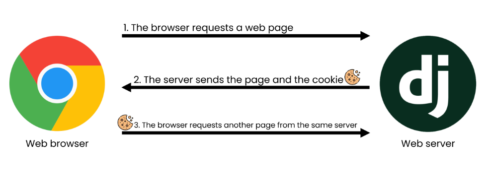

# Django
## INDEX
- 인증과 권한
- Custom User Model
- 쿠키(Cookie)와 세션(Session)
- Django Auth System

## 인증과 권한
### 개요
- Django authentication system(인증 시스템)은 인증(Authentication)과 권한(Authorization)부여를 함께 제공(처리)하며, 이러한 기능을 일반적으로 인증 시스템이라고 함
- 필수 구성은 settings.py에 이미 포함되어 있으며 INSTALLED_APPS에서 확인 가능
  - django.contrib.auth
- Authentication(인증)
  - 신원 확인
  - 사용자가 자신이 누구인지 확인하는 것
- Authorization(권한, 허가)
  - 권한 부여
  - 인증된 사용자가 수행할 수 있는 작업을 결정

## Custom User model
### 개요
- Custom User Model로 대체하기
- 기본 User Model을 필수적으로 Custom User model로 대체하는 이유 이해하기
- Django는 기본적인 인증 시스템과 여러 가지 필드가 포함된 User Model을 제공, 대부분의 개발 환경에서 기본 User Model을 Custom User Model로 대체함
- 개발자들이 작성하는 일부 프로젝트에서는 django에서 제공하는 built-in User model의 기본 인증 요구사항이 적절하지 않을 수 있음
  - 예를 들어, 내 서비스에서 회원가입 시 username 대신 email을 식별 값으로 사용하는 것이 더 적합한 사이트인 경우, Django의 User Model은 기본적으로 username을 식별 값으로 사용하기 때문에 적합하지 않음
- Django는 현재 프로젝트에서 사용할 User Model을 결정하는 **AUTH_USER_MODEL**설정 값으로 Default User Model을 재정의(override)할 수 있도록 함

### AUTH_USER_MODEL
- 프로젝트에서 User를 나타낼 때 사용하는 모델
- 프로젝트가 진행되는 동안 (모델을 만들고 마이그레이션한 후) 변경할 수 없음
- 프로젝트 시작 시 설정하기 위한 것이며, 참조하는 모델은 첫 번째 마이그레이션에서 사용할 수 있어야 함
  - 즉, 첫번째 마이그레이션 전에 확정 지어야 하는 값
- 다음과 같은 기본 값을 가지고 있음
    ```python
    # settings.py

    AUTH_USER_MODEL = 'auth.User'
    ```

### How to substituting a custom User model
대체하기
- AbstractUser를 상속받는 커스텀 User 클래스 작성
- 기존 User 클래스도 AbstractUser를 상속받기 때문에 커스텀 User 클래스도 완전히 같은 모습을 가지게 됨
```python
# accounts/models.py
from django.db import models
from django.contrib.auth.models import AbstractUser

class User(AbstractUser):
    pass
```
- Django 프로젝트에서 User를 나타내는데 사용하는 모델을 방금 생성한 커스텀 User 모델로 지정
```python
# settings.py
AUTH_USER_MODEL = 'accounts.User'
```
- admin.py에 커스텀 User 모델을 등록
  - 기본 User 모델이 아니기 때문에 등록하지 않으면 admin site에 출력되지 않음
```python
# accounts/admin.py
from django.contrib import admin
from django.contrib.auth.admin import UserAdmin
from .models import User

admin.site.register(User, UserAdmin)
```

\[**주의**]프로젝트 중간에 AUTH_USER_MODEL 변경하기
- 모델 관계에 영향을 미치기 때문에 훨씬 더 어려운 작업이 필요
- 결론은 중간 변경은 권장하지 않음(프로젝트 처음에 진행하기)

데이터베이스 초기화
1. migrations 파일 삭제
   - migrations 폴더 및 \_\_init__.py는 삭제하지 않음
   - 번호가 붙은 파일만 삭제
2. db.sqlite3 삭제
3. migrations 진행
   - makemigrations
   - migrate

이후부터는 auth_user 테이블이 아니라 accounts_user 테이블을 사용하게 됨

반드시 User 모델을 대체해야 할까?
- Django는 새 프로젝트를 시작하는 경우 비록 기본 User 모델이 충분 하더라도 커스텀 User 모델을 설정하는 것을 강력하게 권장(highly recommended)
- 커스텀 User 모델은 기본 User 모델과 동일하게 작동하면서도 필요한 경우 나중에 맞춤 설정할 수 있기 때문
  - 단, User 모델 대체 작업은 프로젝트의 모든 migrations 혹은 첫 migrate를 실행하기 전에 이 작업을 마쳐야 함

## HTTP
### HTTP
- Hyper Text Transfer Protocol
- HTML 문서와 같은 리소스들을 가져올 수 있도록 해주는 프로토콜(규칙, 규약)
- 웹(WWW)에서 이루어지는 모든 데이터 교환의 기초
- 클라이언트-서버 프로토콜이라고도 부름

### 요청과 응답
- 요청(requests)
  - 클라이언트(브라우저)에 의해 전송되는 메시지
- 응답(response)
  - 서버에서 응답으로 전송되는 메시지

### 특징
비연결 지향(connectionless)
- 서버는 요청에 대한 응답을 보낸 후 연결을 끊음
  - 예를 들어 우리가 네이버 메인 페이지를 보고 있을 때 우리는 네이버 서버와 연결되어 있는 것이 아님
  - 네이버 서버는 우리에게 메인 페이지를 응답하고 연결을 끊은 것

무상태(stateless)
- 연결을 끊는 순간 클라이언트와 서버 간의 통신이 끝나며 상태 정보가 유지되지 않음
- 클라이언트와 서버가 주고받는 메시지들은 서로 완전히 독립적

### 어떻게 로그인 상태를 유지할까?
- 우리가 로그인을 하고 웹 사이트를 사용할 때 페이지를 이동해도 로그인 '상태'가 유지됨
- 서버와 클라이언트 간 지속적인 상태 유지를 위해 '**쿠키**'와 '**세션**'이 존재

## 쿠키(Cookie)
### 개요
- HTTP 쿠키는 상태가 있는 세션을 만들도록 해 줌

### 개념
- 서버가 사용자의 웹 브라우저에 전송하는 작은 데이터 조각이다
- 사용자가 웹사이트를 방문할 경우 해당 웹사이트의 서버를 통해 사용자의 컴퓨터에 설치되는 작은 기록 정보 파일
  - 브라우저(클라이언트)는 쿠키를 로컬에 KEY-VALUE의 데이터 형식으로 저장
  - 쿠키를 저장해 놓았다가, 동일한 서버에 재요청 시 저장된 쿠키를 함께 전송
- 쿠키는 두 요청이 동일한 브라우저에서 들어왔는지 아닌지를 판단할 때 주로 사용됨
  - 이를 이용해 사용자의 로그인 상태를 유지할 수 있음
  - 상태가 없는(stateless) HTTP 프로토콜에서 상태 정보를 기억 시켜주기 때문
- 즉, 웹 페이지에 접속하면 웹 페이지를 응답한 서버로부터 쿠키를 받아 브라우저에 저장하고, 클라이언트가 같은 서버에 재요청 시마다 요청과 함께 저장해 두었던 쿠키도 함께 전송

### 쿠키 사용 예시


### 쿠키 사용 목적
- 세션 관리(Session management)
  - 로그인, 아이디 자동완성, 공지 하루 안 보기, 팝업체크, 장바구니 등의 정보 관리
- 개인화(Personalization)
  - 사용자 선호, 테마 등의 설정
- 트래킹(Tracking)
  - 사용자 행동을 기록 및 분석

### 세션(Session)
- 사이트와 특정 브라우저 사이의 'state(상태)'를 유지시키는 것
- 클라이언트가 서버에 접속하면 서버가 특정 session id를 발급하고, 클라이언트는 session id를 쿠키에 저장
  - 클라이언트가 다시 동일한 서버에 접속하면 요청과 함께 쿠키(session id가 저장된)를 서버에 전달
  - 쿠키는 요청 때마다 서버에 함께 전송 되므로 서버에서 session id를 확인해 알맞은 로직을 처리
- session id는 세션을 구별하기 위해 필요하며, 쿠키에는 session id만 저장

### 쿠키 Lifetime(수명)
- Session cookie
  - 현재 세션(current session)이 종료되면 삭제됨
  - 브라우저 종료와 함께 세션이 삭제됨
- Persistent cookies
  - Expires 속성에 지정된 날짜 혹은 Max-Age 속성에 지정된 기간이 지나면 삭제됨

### Session in Django
- Django는 database-backed sessions 저장 방식을 기본 값으로 사용
  - session 정보는 Django DB의 django_session 테이블에 저장
- Django는 특정 session id를 포함하는 쿠키를 사용해서 각각의 브라우저와 사이트가 연결된 session을 알아냄
- Django는 우리가 session 메커니즘(복잡한 동작원리)에 대부분을 생각하지 않게끔 많은 도움을 줌

### Authentication in Web requests
개요
- Django가 제공하는 인증 관련 built-in forms 익히기

## 로그인
### 개요
- 로그인은 Session을 Create하는 과정

### AuthenticationForm
- 로그인을 위한 built-in form
  - 로그인 하고자 하는 사용자 정보를 입력 받음
  - 기본적으로 username과 password를 받아 데이터가 유효한지 검증
- request를 첫번째 인자로 취함

### 로그인 페이지 작성
```python
# accounts/urls.py
from django.urls import path
from . import views

app_name = 'accounts'
urlpatterns = [
    path('login/', views.login, name='login'),
]
```
```python
# accounts/views.py
from django.shortcuts import render
from django.contrib.auth.forms import AuthenticationForm

def login(request):
    if request.method == 'POST':
        pass
    else:
        form = AuthenticationForm()
    context = {
        'form': form
    }
    return render(request, 'accounts/login.html', context)
```
```html
<!-- accounts/login.html -->



  <h1>로그인</h1>
  <form action="" method="POST">
    
    {{ form.as_p }}
    <input type="submit">
  </form>

```

### login()
- login(request, user, backend=None)
- 인증된 사용자를 로그인 시키는 로직으로 view 함수에서 사용됨
- 현재 세션에 연결하려는 인증 된 사용자가 있는 경우 사용
- HttpRequest 객체와 User 객체가 필요

### 로그인 로직 작성
- 로그인 페이지 작성
- view 함수 login과의 충돌을 방지하기 위해 import한 login 함수 이름을 auth_login으로 변경해서 사용
```python
from django.shortcuts import render, redirect
from django.contrib.auth.forms import AuthenticationForm
from django.contrib.auth import login as auth_login

def login(request):
    if request.method == 'POST':
        form = AuthenticationForm(request, request.POST)
        if form.is_valid():
            auth_login(request, form.get_user())
            return redirect('articles:index')
    else:
        form = AuthenticationForm()
    context = {
        'form': form
    }
    return render(request, 'accounts/login.html', context)
```

### get_user()
- AuthenticationForm의 인스턴스 메서드
- 유효성 검사를 통과했을 경우 로그인 한 사용자 객체를 반환

### 세션 데이터 확인하기


### Authentication with User
개요
- 템플릿에서 인증 관련 데이터를 출력하는 방법

현재 로그인 되어있는 유저 정보 출력하기
- 템플릿에서 인증 관련 데이터를 출력하는 방법
```html
<h3>Hello, {{ user }}</h3>
```
- 어떻게 base 템플릿에서 context 데이터 없이 user 변수를 사용할 수 있을까?
  - settings.py의 context processors 설정 값 때문

### context processors
- 템플릿이 렌더링 될 때 호출 가능한 컨텍스트 데이터 목록
- 작성된 컨텍스트 데이터는 기본적으로 템플릿에서 사용 가능한 변수로 포함됨
- 즉, django에서 자주 사용하는 데이터 목록을 미리 템플릿에 로드 해 둔 것
- 현재 user 변수를 담당하는 프로세서는 django.contrib.auth.context_processors.auth

### django.contrib.auth.context_processors.auth
- 현재 로그인한 사용자를 나타내는 User 클래스의 인스턴스가 템플릿 변수 {{ user }}에 저장됨
  - 클라이언트가 로그인하지 않은 경우 AnonymousUser 클래스의 인스턴스로 생성

## Logout
### 개요
- 로그아웃은 Session을 Delete하는 과정

### logout()
- logout(request)
- HttpRequest 객체를 인자로 받고 반환 값이 없음
- 사용자가 로그인하지 않은 경우 오류를 발생시키지 않음
- 다음 2가지 일을 처리한다.
  - 현재 요청에 대한 session data를 DB에서 삭제
  - 클라이언트의 쿠키에서도 session id를 삭제
- 이는 다른 사람이 동일한 웹 브라우저를 사용하여 로그인하고, 이전 사용자의 세션 데이터에 액세스하는 것을 방지하기 위함

### 로그아웃 로직 작성하기
```python
# accounts/urls.py

from django.urls import path
from . import views

app_name = 'accounts'
urlpatterns = [
    path('login/', views.login, name='login'),
    path('logout/', views.logout, name='logout'),
]
```
```python
# accounts/views.py
from django.contrib.auth import logout as auth_logout

def logout(request):
    auth_logout(request)
    return redirect('articles:index')
```
```html
<!-- base.html -->
<form action="" method="POST">
  
  <input type="submit" value="Logout">
</form>
```