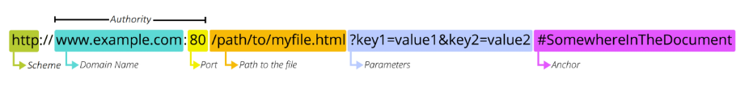

# Django
## INDEX
- REST API
- Response JSON
- Django REST framework(Single Model)
  - GET(List, Detail)
----------------
## REST API
### HTTP
특징
- Stateless(무상태)
  - 동일한 연결에서 연속적으로 수행되는두 요청 사이에 링크가 없음
  - 응답을 마치고 연결을 끊는 순간 클라이언트와 서버 간의 통신이 끝나며 상태 정보가 유지되지 않음

대표 HTTP Request Methods
- GET
  - 서버에 리소스의 표현을 요청
  - GET을 사용하는 요청은 데이터만 검색해야 함
- POST
  - 데이터를 지정된 리소스에 제출
  - 서버의 상태를 변경
- PUT
  - 요청한 주소의 리소스를 수정
- DELETE
  - 지정된 리소스를 삭제

### Identifying resources on the Web
웹에서 리소스를 식별하는 방법에 대해 학습
- HTTP 요청의 대상을 리소스라고 한다
- 리소스는 문서, 사진 또는 기타 어떤 것이든 될 수 있다
- 각 리소스는 식별을 위해 URI로 식별된다

### URI
- Uniform Resource Identifier(통합 자원 식별자)
- 인터넷에서 리소스를 식별하는 문자열
- 가장 일반적인 URI는 웹 주소로 알려진 URL
- 특정 이름공간에서 이름으로 리소스를 식별하는 URI는 URN
  - URL과 달리 자원의 위치에 영향을 받지 않는 유일한 이름 역할을 함(독립적)
  - URL의 단점을 극복하기 위해 등장했으며 자원이 어디에 위치한지 여부와 관계없이 이름만으로 자원을 식별
  - 하지만 이름만으로 실제 리소스를 찾는 방법은 보편화 되어있지 않아 현재는 URL을 대부분 사용
  - ex) ISBN(국제표준 도서번호), ISAN(국제표준 시청각 자료번호)

### URL
- Uniform Resource Locator(통합 자원 위치)
- 웹에서 주어진 리소스의 주소
- 네트워크 상에 리소스가 어디 있는지를 알려주기 위한 약속
  - 이러한 리소스는 HTML, CSS, 이미지 등이 될 수 있음
- URL은 다음과 같이 여러 부분으로 구성되며 일부는 필수이고 나머지는 선택사항


#### URL 구조
- Scheme(or protocol)
  - 브라우저가 리소스를 요청하는 데 사용해야 하는 프로토콜
  - URL의 첫 부분은 브라우저가 어떤 규약을 사용하는지를 나타냄
  - 기본적으로 웹은 HTTP(S)를 요구하며 메일을 열기위한 mailto:, 파일을 전송하기 위한 ftp: 등 다른 프로토콜도 존재
- Authority
  - Scheme 다음은 문자 패턴 ://으로 구분된 Authority(권한)이 작성됨
  - Authority는 domain과 port를 모두 포함하며 둘은 :(콜론)으로 구분됨
  - Domain Name
    - 요청 중인 웹 서버를 나타냄
    - 어떤 웹 서버가 요구되는 지를 가리키며 직접 IP 주소를 사용하는 것도 가능하지만, 사람이 외우기 어렵게 때문에 주로 Domain Name으로 사용
    - 예를 들어 도메인 google.com의 IP 주소는 142.251.42.142
  - Port
    - 웹 서버의 리소스에 접근하는데 사용되는 기술적인 문(Gate)
    - HTTP 프로토콜의 표준 포트는 다음과 같고 생략이 가능(나머지는 생략 불가능)
      - HTTP - 80
      - HTTPS - 443
    - Django의 경우 8000(80+00)이 기본 포트로 설정되어 있음
- Path
  - 웹 서버의 리소스 경로
  - 초기에는 실제 파일이 위치한 물리적 위치를 나타냈지만, 오늘날은 실제 위치가 아닌 추상화된 형태의 구조를 표현
  - 예를 들어 /articles/create/가 실제 articles 폴더안에 create 폴더안을 의미하는 것은 아님
- Parameters
  - 웹 서버에 제공하는 추가적인 데이터
  - 파라미터는 '&' 기호로 구분되는 key-value 쌍 목록
  - 서버는 리소스를 응답하기 전에 이러한 파라미터를 사용하여 추가 작업을 수행할 수 있음
- Anchor
  - 하이퍼링크와 비슷한 기능을 하는 인터넷상의 다른 문서와 연결된 문자 혹은 그림
  - 리소스의 다른 부분에 대한 앵커
  - 리소스 내부 일종의 '북마크'를 나타내며 브라우저에 해당 북마크 지점에 있는 콘텐츠를 표시
    - 예를 들어 HTML 문서에서 브라우저는 앵커가 정의한 지점으로 스크롤 함
  - fragment identifier(부분 식별자)라고 부르는 '#'이후 부분은 서버에 전송되지 않음

### 정리
- 웹에서의 리소스 식별
  - 자원의 식별자(URI)
    - 자원의 위치로 자원을 식별(URL)
    - 고유한 이름으로 자원을 식별(URN)

### REST API
#### API
- Application Programming Interface
- 애플리케이션과 프로그래밍으로 소통하는 방법
  - 개발자가 복잡한 기능을 보다 쉽게 만들 수 있도록 프로그래밍 언어로 제공되는 구성
- API를 제공하는 애플리케이션과 다른 소프트웨어 및 하드웨어 등의 것들 사이의 간단한 계약(인터페이스)이라고 볼 수 있음
- API는 복잡한 코드를 추상화하여 대신 사용할 수 있는 몇 가지 더 쉬운 구문을 제공
  - 예를 들어 집의 가전 제품에 전기를 공급하기 위해 직접 배선을 하지 않는다

#### Web API
- 웹 서버 또는 웹 브라우저를 위한 API
- 현재 웹 개발은 모든 것을 하나부터 열까지 직접 개발하기보다 여러 Open API를 활용하는 추세
  - Open API : 개발자라면 누구나 사용할 수 있도록 공개된 API
  - 개발자에게 사유 응용 소프트웨어나 웹 서비스의 프로그래밍적 권한을 제공
- 대표적인 Third Party Open API 서비스 목록
  - Youtube API
  - Naver Papago API
  - Kakao Map API
- API는 다양한 타입의 데이터를 응답
  - HTML, XML, JSON 등

#### REST
- Representational State Transfer
- API Server를 개발하기 위한 일종의 소프트웨어 설계 방법론
  - 2000년 로이 필딩의 박사학위 논문에서 처음 소개된 후 네트워킹 문화에 널리 퍼짐
- '소프트웨어 아키텍쳐 디자인 제약 모음'
- REST 원리를 따르는 시스템을 RESTful하다고 부름
- REST의 기본 아이디어는 리소스 즉 자원
  - 자원을 정의하고 자원에 대한 주소를 지정하는 전반적인 방법을 서술

#### REST에서 자원을 정의하고 주소를 지정하는 방법
- 자원의 식별
  - URI
- 자원의 행위
  - HTTP Method
- 자원의 표현
  - 자원과 행위를 통해 궁극적으로 표현되는 결과물
  - JSON으로 표현된 데이터를 제공

#### JSON
- JSON is a lightweight data-interchange format
- JavaScript의 표기법을 따른 단순 문자열
- 파이썬의 dictionary, 자바스크립트의 object처럼 C 계열의 언어가 갖고 있는 자료구조로 쉽게 변환할 수 있는 key-value 형태의 구조를 갖고 있음
- 사람이 읽고 쓰기 쉽고 기계가 파싱(해석&분석)하고 만들어내기 쉽기 때문에 현재 API에서 가장 많이 사용하는 데이터 타입

#### REST 정리
- 자원을 정의하고 자원에 대한 주소를 지정하는 방법의 모음
  - 자원을 식별 : URI
  - 자원에 대한 행위 : HTTP Methods
  - 자원을 표현 : JSON
- 설계 방법론은 지키지 않았을 때 잃는 것보다 지켰을 때 얻는 것이 훨씬 많음
  - 단, 설계 방법론을 지키지 않더라도 동작 여부에 큰 영향을 미치지는 않음
  - 말 그대로 방법론일 뿐이며 규칙이나 규약은 아님
-----------------
## Response JSON
### 개요
- JSON 형태로의 서버 응답 변화
- 다양한 방법의 JSON 응답

### Response
다양한 방법으로 JSON 데이터 응답해보기
- HTML 응답
- JsonResponse()를 사용한 JSON 응답
- Django Serializer를 사용한 JSON 응답
- Django REST framework를 사용한 JSON 응답

#### JsonResponse()를 사용한 JSON 응답
- 이제는 문서 한 장을 응답하는 것이 아닌 JSON 데이터를 응답해보기
- Django가 기본적으로 제공하는 JsonResponse 객체를 활용하여 Python 데이터 타입을 손쉽게 JSON으로 변환하여 응답 가능
```python
# articles/views.py
from django.http.response import JsonResponse

def article_json_1(request):
    articles = Article.objects.all()
    articles_json = []
    for article in articles:
        articles_json.append(
            {
                'id': article.pk,
                'title': article.title,
                'content': article.content,
                'created_at': article.created_at,
                'updated_at': article.updated_at,
            }
        )
    return JsonResponse(articles_json, safe=False)
```
- JsonResponse()
  - JSON-encoded response를 만드는 클래스
  - 'safe' parameter
    - 기본 값 : True (dict 인스턴스만 허용됨)
    - False로 설정 시 모든 타입의 객체를 serialization 할 수 있음

#### Django Serializer를 사용한 JSON 응답
- Django의 내장 HttpResponse()를 활용한 JSON 응답
- 이전에는 JSON의 모든 필드를 하나부터 열까지 작성해야 했지만 이제는 그렇지 않음
```python
# articles/views.py
from django.http.response import HttpResponse
from django.core import serializers

def article_json_2(request):
    articles = Article.objects.all()
    data = serializers.serialize('json', articles)
    return HttpResponse(data, content_type='application/json')
```
- Serialization
  - 직렬화
  - 여러 시스템에서 활용하기 위해 데이터 구조나 객체 상태를 나중에 재구성할 수 있는 포맷으로 변환하는 과정
    - 즉, 어떠한 언어나 환경에서도 **나중에 다시 쉽게 사용할 수 있는 포맷으로 변환하는 과정**
  - 변환 포맷은 대표적으로 json, xml, yaml이 있으며 json이 가장 보편적으로 쓰임

#### Django REST framework를 사용한 JSON 응답
- Django REST framework(DRF)
  - Django에서 Restful API 서버를 쉽게 구축할 수 있도록 도와주는 오픈소스 라이브러리
  - Web API 구축을 위한 강력한 toolkit을 제공
  - REST framework를 작성하기 위한 여러 기능을 제공
  - DRF의 serializer는 Django의 Form 및 ModelForm 클래스와 매우 유사하게 작동
- DRF 설치 확인
```python
# settings.py

INSTALLED_APPS = [
  ...,
  'rest_framework',
]
```
```python
# articles/serializers.py
from rest_framework import serializers
from .models import Article

class ArticleSerializer(serializers.ModelSerializer):
    
    class Meta:
        model = Article
        fields = '__all__'
```
```python
# articles/views.py

@api_view(['GET'])
def article_json_3(request):
    articles = Article.objects.all()
    serializer = ArticleSerializer(articles, many=True)
    return Response(serializer.data)
```

#### 직접 requests 라이브러리를 사용하여 json 응답 받아보기

#### 정리
- 우리는 DFR를 활용하여 JSON 데이터를 응답하는 Django 서버를 구축할 것
--------------
## Django REST framework - Single Model
### 개요
- 단일 모델의 data를 Serialization하여 JSON으로 변환하는 반법에 대한 학습

### ModelSerializer
```python
# articles/serializers.py
```
- ModelSerializer 클래스는 모델 필드에 해당하는 필드가 있는 Serializer 클래스를 자동으로 만들 수 있는 shortcut을 제공
  - Model 정보에 맞춰 자동으로 필드를 생성
  - serializer에 대한 유효성 검사기를 자동으로 생성
  - .create() 및 .update()
- many option
  - 단일 객체 인스턴스 대신 QuerySet 또는 객체 목록을 serialize하려면 many=True를 작성해야 함