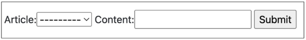

# DB
## INDEX
- A many-to-one relationship
- N:1 (Comment - Article)
- N:1 (Article - User)
--------------------------------------
## A many-to-one relationship
### 개요
- 관계형 데이터베이스에서의 외래 키 속성을 사용해 모델간 N:1 관계 설정하기

### RDB에서의 관계
- 1:1
  - One-to-one relationships
  - 한 테이블의 레코드 하나가 다른 테이블의 레코드 단 한 개와 관련된 경우
- N:1
  - Many-to-one relationships
  - 한 테이블의 0개 이상의 레코드가 다른 테이블의 레코드 한 개와 관련된 경우
  - 기준 테이블에 따라(1:N, One-to-many relationships)이라고도 함
- M:N
  - Many-to-many relationships
  - 한 테이블의 0개 이상의 레코드가 다른 테이블의 0개 이상의 레코드와 관련된 경우
  - 양쪽 모두에서 N:1 관계를 가짐

### Foreign Key
#### 개념
- 외래 키(외부 키)
- 관계형 데이터베이스에서 다른 테이블의 행을 식별할 수 있는 키
- 참조되는 테이블의 기본 키(Primary Key)를 가리킴
- 참조하는 테이블의 행 1개의 값은, 참조되는 측 테이블의 행 값에 대응됨
  - 이 때문에 참조하는 테이블의 행에는, 참조되는 테이블에 나타나지 않는 값을 포함할 수 없음
- 참조하는 테이블 행 여러 개가, 참조되는 테이블의 동일한 행을 참조할 수 있음

#### 특징
- 키를 사용하여 부모 테이블의 유일한 값을 참조(참조 무결성)
- 외래 키의 값이 반드시 부모 테이블의 기본 키 일 필요는 없지만 유일한 값이어야 함

### 참조 무결성
- 데이터베이스 관계 모델에서 관련된 2개의 테이블 간의 일관성을 말함
- 외래 키가 선언된 테이블의 외래 키 속성(열)의 값은 그 테이블의 부모가 되는 테이블의 기본 키 값으로 존재해야 함
----------------------
## N:1(Comment - Article)
### 개요
- Comment(N)-Article(1)
- Comment 모델과 Article 모델 간 관계 설정
- 0개 이상의 댓글은 1개의 게시글에 작성 될 수 있음

### 모델 관계 설정
- 게시판의 게시글과 N:1 관계를 나타낼 수 있는 댓글 구현
- N:1 관계에서 댓글을 담당할 Comment 모델은 N, Article 모델은 1이 될 것

### Django Relationship fields
- OneToOneField()
- ForeignKey()
- ManyToManyField()

#### ForeignKey(to, on_delete, **otions)
- A many-to-one relationship을 담당하는 Django의 모델 필드 클래스
- Django 모델에서 관계형 데이터베이스의 외래 키 속성을 담당
- 2개의 필수 위치 인자가 필요
  - 참조하는 model class
  - on_delete 옵션

### Comment Model
```python
# articles/models.py

class Comment(models.Model):
  article = models.ForeignKey(Article, on_delete=models.CASCADE)
  content = models.CharField(max_length=200)
  created_at = models.DateTimeField(auto_now_add=True)
  updated_at = models.DateTimeField(auto_now=True)

  def __str__(self):
    return self.content
```
- 외래 키 필드는 ForeignKey 클래스를 작성하는 위치와 관계없이 필드의 마지막에 작성됨
- ForeignKey() 클래스의 인스턴스 이름은 참조하는 모델 클래스 이름의 단수형(소문자)으로 작성하는 것을 권장

#### ForeignKey arguments - on_delete
- 외래 키가 참조하는 객체가 사라졌을 때, 외래 키를 가진 객체를 어덯게 처리할 지를 정의
- 데이터 무결성을 위해서 매우 중요한 설정
- on_delete 옵션 값
  - CASCADE: 부모 객체(참조된 객체)가 삭제 됐을 때 이를 참조하는 객체도 삭제
  - PROTECT, SET_NULL, SET_DEFAULT 등 여러 옵션 값들이 존재


### 관계 모델 참조
#### 역참조
- 나를 참조하는 테이블을 참조하는 것
- 즉, 본인을 외래키로 참조 중인 다른 테이블에 접근하는 것
- N:1 관계에서는 1이 N을 참조하는 상황
  - 외래 키를 가지지 않은 1이 외래 키를 가진 N을 참조

#### Related manager
- Related manager는 N:1 혹은 M:N 관계에서 사용 가능한 문맥(context)
- Django는 모델 간 N:1 혹은 M:N 관계가 설정되면 역참조할 때에 사용할 수 있는 manager를 생성
  - 이전에 모델 생성 시 objects라는 매니저를 통해 queryset api를 사용했던 것처럼 related manager를 통해 queryset api를 사용할 수 있게 됨
- 지금은 N:1 관게에서의 related manager 만을 학습할 것

```article.comment_set.method()```
- Article 모델이 Comment 모델을 참조(역참조)할 때 사용하는 매니저
- article.comment 형식으로는 댓글 객체를 참조 할 수 없음
  - 실제로 Article 클래스에는 Comment와의 어떠한 관계도 작성되어 있지 않음
- 대신 Django가 역참조 할 수 있는 comment_set manager를 자동으로 생성해 article.comment_set 형태로 댓글 객체를 참조할 수 있음
- 반면 참조 상황(Comment > Article)에서는 실제 ForeignKey 클래스로 작성한 인스턴스가 Comment 클래스의 클래스 변수이기 때문에 comment.article 형태로 작성 가능

#### ForeignKey arguments - related_name
```python
class Comment(models.Model):
  article = models.ForeignKey(Article, on_delete=models.CASCADE, related_name='comments')
```
- ForeignKey 클래스의 선택 옵션
- 역참조 시 사용하는 매니저 이름(model_set manager)을 변경할 수 있음
- 작성 후, migration 과정이 필요
- 선택 옵션이지만 상황에 따라 반드시 작성해야 하는 경우가 생기기도 하는데 이는 추후 자연스럽게 만나볼 예정
- 작성 후 다시 원래 코드로 복구
-----------------
## Comment 구현
### CREATE
```python
# articles/form.py
# 사용자로부터 댓글 데이터를 입력 받기 위한 CommentForm 작성
from .models import Article, Comment

class CommentForm(forms.ModelForm):
  class Meta:
    model = Comment
    fields = '__all__'
```
```python
# articles/views.py
# detail 페이지에서 CommentForm 출력(view 함수)
from .forms import ArticleForm, CommentForm

def detail(request, pk):
  article = Article.objects.get(pk=pk)
  comment_form = CommentForm() # 기존 ArticleForm 클래스의 인스턴스명을 form으로 작성했기 때문에 헷갈리지 않도록 comment_form으로 작성
  context = {
    'article': article,
    'comment_form': comment_form
  }
  return render(request, 'articles/detail.html', context)
```
```html
<!-- articles/detail.html -->
<!-- detail 페이지에서 CommentForm 출력(템플릿) -->
...
<form action="#" method="POST">
  
  {{comment_form}}
  <input type="submit">
</form>
```

- detail 페이지에 출력된 CommentForm을 살펴보면 다음과 같이 출력됨
- 실 서비스에서는 댓글을 작성할 때 댓글을 어떤 게시글에 작성하는지 직접 게시글 번호를 선택하지 않음
- 실제로는 해당 게시글에 댓글을 작성하면 자연스럽게 그 게시글에 댓글이 작성되어야 함
- 다음과 같이 출력되는 이유는 Comment 클래스의 외래 키 필드 article 또한 데이터 입력이 필요하기 때문에 출력되고 있는 것
- 하지만, 외래 키 필드는 사용자의 입력으로 받는 것이 아니라 view 함수 내에서 받아 별도로 처리되어 저장되어야 함

```python
# articles/forms.py
# 외래 키 필드를 출력에서 제외

class CommentForm(forms.ModelForm):
  class Meta:
    model = Comment
    exclude = ('article',)
```

- 출력에서 제외된 외래 키 데이터는 어디서 받아와야 할까?
- variable routing을 사용

```python
# articles/urls.py

urlpatterns = [
  ...,
  path('<int:pk>/comments/', views.comments_create, name='comments_create'),
]
```
```python
# articles/views.py

def comment_create(request, pk):
  article = Article.objects.get(pk=pk)
  comment_form = CommentForm(request.POST)
  if comment_form.is_valid():
    comment = comment_form.save(commit=False)
    comment.article = article
    comment.save()
  return redirect('articles:detail', article.pk)
```
- save(commit=False)
  - 아직 데이터베이스에 저장되지 않은 인스턴스를 반환
  - 저장하기 전에 객체에 대한 사용자 지정처리를 수행할 때 유용하게 사용

```html
<!-- articles/detail.html -->

<form action="" method="POST">
  
  {{comment_form}}
  <input type="submit">
</form>
```

### READ
- 작성한 댓글 목록 출력하기
```python
# articles/views.py
# 특정 article에 있는 모든 댓글을가져온 후 context에 추가
from .models import Article, Comment

def detail(request, pk):
  article = Article.objects.get(pk=pk)
  comment_form = CommentForm()
  comments = article.comment_set.all()
  context = {
    'article': article,
    'comment_form': comment_form,
    'comments': comments,
  }
  return render(request, 'articles/detail.html', context)
```
```html
<!-- articles/detail.html -->
<!-- detail 템플릿에서 댓글 목록 출력 -->

<h4>댓글 목록</h4>
<ul>
  
    <li>{{comment.content}}</li>
  
</ul>
```

### DELETE
```python
# articles/urls.py

urlpatterns = [
  ...,
  path('<int:article_pk>/comments/<int:comment_pk>/delete/', views.comments_delete, name='comments_delete'),
]
```
```python
# articles/views.py

def comments_delete(request, article_pk, comment_pk):
  comment = Comment.objects.get(pk=comment_pk)
  comment.delete()
  return redirect('articles:detail', article_pk)
```
```html
<!-- articles/detail.html -->
<!-- 댓글을 삭제할 수 있는 버튼을 각각의 댓글 옆에 출력될 수 있도록 함-->

<li>
  {{comment.content}}
  <form action="" method="POST">
    
    <input type="submit" value="DELETE">
  </form>
</li>
```

### Comment 추가 사항
- 댓글 개수 출력하기
  - DTL filter - length 사용
  - Queryset API - count() 사용
- 댓글이 없는 경우 대체 컨텐츠 출력하기
---------------
## N:1(Article - User)
### 개요
- Article(N) - User(1)
- Article 모델과 User 모델 간 관계 설정
- "0개 이상의 게시글은 1개의 회원에 의해 작성 될 수 있음"

### Referencing the User model
- settings.AUTH_USER_MODEL
  - 반환 값: 'accounts.User'(문자열)
  - User 모델에 대한 외래 키 또는 M:N 관계를 정의 할 때 사용
  - models.py의 모델 필드에서 User 모델을 참조할 때 사용
- get_user_model()
  - 반환 값: User Object(객체)
  - 현재 활성화(active)된 User 모델을 반환
  - 커스터마이징한 User 모델이 있을 경우는 Custom User 모델, 그렇지 않으면 User를 반환
  - models.py가 아닌 다른 모든 곳에서 유저 모델을 참조할 때 사용
- 정리
  - 문자역과 객체를 반환하는 특징과 Django 내부적인 실행 원리에 관련된 것
  - models.py 에서는 settings.AUTH_USER_MODEL
  - 다른 모든 곳에서는 get_user_model()

### 모델 관계 설정
```python
# articles/models.py
from django.conf import settings

class Article(models.Model):
  user = models.ForeignKey(settings.AUTH_USER_MODEL, on_delete=models.CASCADE)
```