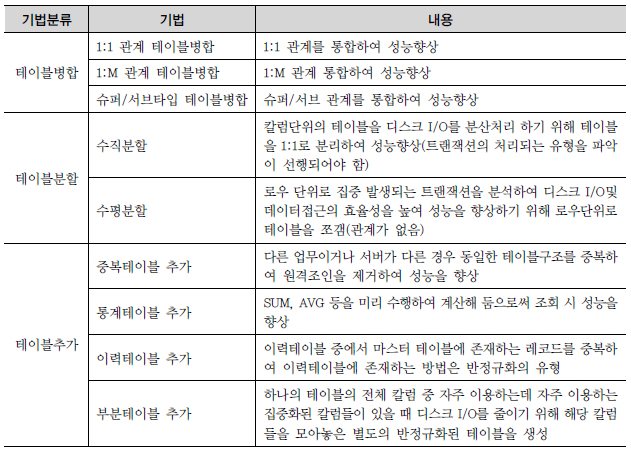
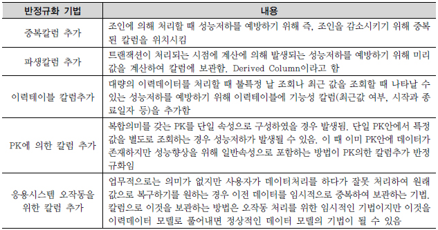
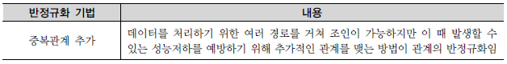

# 성능 데이터 모델링
## 성능 데이터 모델링 고려사항
- 데이터 모델링을 할 때 정규화를 정확하게 수행한다
- 데이터베이스 용량산정을 수행한다
- 데이터베이스에 발생하는 트랜잭션의 유형을 파악한다
- 용량과 트랜잭션의 유형에 따라 반정규화를 수행한다
- 이력모델의 조정, PK/FK 조정, 슈퍼타입/서브타입 조정 등을 수행한다.
- 성능관점에서 데이터 모델을 검증한다.

## 정규화
### 정규화를 통한 성능 향상 전략
- 정규화는 기본적으로 데이터에 대한 중복성을 제거해주고 데이터가 관심사별로 처리되는 경우가 많기 때문에 성능이 향상되는 특징을 가지고 있다.
- 엔터티가 계속 발생되므로 SQL문장에서 조인이 많이 발생하여 이로 인한 성능저하가 나타나는 경우도 있다.
  - 사례별로 유의하여 반정규화를 적용하는 전략이 필요

### 함수적 종속성
- 데이터들이 어떤 기준값에 의해 종속되는 현상(데이터가 가지고 잇는 근본적인 속성)
- 기준값을 결정자, 종속되는 값을 종속자라 한다.
- 기본적으로 데이터는 속성간의 함수종속성에 근거하여 정규화되어야 한다.

## 반정규화
- 정규화를 수행하지 않은 모델은 비정규화
- 정규환된 엔터티, 속성, 관계에 대해 시스템의 성능향상과 개발, 운영의 단순화를 위해 중복, 통합, 분리 등을 수행하는 데이터 모델링의 기법
- 데이터 무결성이 깨질 수 있는 위험을 무릅쓰고 데이터를 중복하여 반정규화를 적용하는 이유는 데이터를 조회할 때 디스크 I/O량이 많아서 성능이 저하되거나 조인으로 인한 성능저하, 컬럼을 계산하여 읽을 때 성능이 저하될 것이 예상되는 경우 수행하게 된다.

### 적용방법
- 보통 프로젝트에서는 컬럼 중복을 통해서만 반정규화를 수행
- 반정규화 필요성이 결정되면 컬럼의 반정규화 뿐만 아니라 테이블의 반정규화와 관계의 반정규화를 종합적으로 고려하여 적용해야 한다.
- 성능을 향상시킬 수 있는 다른 방법들을 고려하고 그 이후에 반정규화를 적용하여야 한다.
- 반드시 데이터 무결성을 보장할 수 있는 방법을 고려한 이후에 반정규화를 적용하여야 한다.
1. 반정규화의 대상을 조사한다.
   - 일단 전체 데이터의 양을 조사하고 그 데이터가 해당 프로세스를 처리할 때 성능저하가 나타날 수 있는지 검증해야 한다. 데이터가 대량이고 성능이 저하될 것으로 예상이 되면 다음 4가지 경우를 고려하여 반정규화를 고려하게 된다.
   - 자주 사용하는 테이블에 접근하는 프로세스의 수가 많고 항상 일정한 범위만을 조회하는 경우
   - 테이블에 대량의 데이터가 잇고 대량의 데이터 범위를 자주 처리하는 경우에 처리범위를 일정하게 줄이지 않으면 성능을 보장할 수 없을 경우
   - 통계성 프로세스에 의해 통계정보를 필요로 할 때
   - 테이블에 지나치게 많은 조인이 걸려 데이터를 조회하는 작업이 기술적으로 어려울 경우
2. 반정규화의 대상에 대해 다른 방법으로 처리할 수 있는지 검토한다.
   - 데이터를 중복하여 데이터 무결성을 깨뜨릴 위험을 제어하기 위하여 반정규화를 결정하기 이전에 성능을 향상시킬 수 있는 다른 방법을 모색하도록 한다.
   - 뷰를 사용하여 해결
   - 클러스터링을 적용하거나 인덱스를 조정하여 해결
   - PK의 성격에 따라 부분적인 테이블로 분리하여 파티셔닝 기법으로 해결
   - 응용 어플리케이션에서 로직을 구사하는 방법을 변경하여 해결
3. 반정규화를 적용한다. 

### 반정규화 기법
- 테이블 반정규화

- 칼럼 반정규화

- 관계 반정규화

    - 테이블과 칼럼의 반정규화와 달리 데이터 무결성을 깨뜨릴 위험을 갖지 않고서도 데이터처리의 성능을 향상시킬 수 있는 기법이다. 

## 대량 데이터
### 대량 데이터발생에 따른 테이블 분할