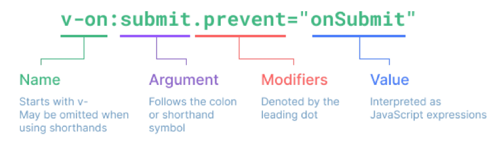

# Vue
## INDEX
- Basic of syntax
- Directives
- Vue advanced
- Vue Style Guide
------------
## Basic of Syntax
### Template Syntax
- 렌더링 된 DOM을 기본 Vue instance의 data에 선언적으로 바인딩할 수 있는 HTML 기반 template syntax를 사용
  - 렌더링 된 DOM : 브라우저에 의해 보기 좋게 그려질 HTML 코드
  - HTML 기반 template syntax : HTML 코드에 직접 작성할 수 있는 문법 제공
  - 선언적으로 바인딩 : Vue instance와 DOM을 연결

### Text Interpolation
- 가장 기본적인 바인딩 방법
- 중괄호 2개로 표기
- DTL과 동일한 형태로 작성
- Text interpolation 방법은 모두 일반 텍스트로 표현

### RAW HTML
- v-html directive를 사용하여 data와 바인딩
- directive-HTML 기반 template syntax
- HTML의 기본 속성이 아닌 Vue가 제공하는 특수 속성의 값으로 data를 작성
----------------
## Directives
### Directives 기본 구성
- v-접두사가 있는 특수 속성에는 값을 할당할 수 있음
  - 값에는 JS 표현식을 작성할 수 있음
- directive의 역할은 표현식의 값이 변경될 때 반응적으로 DOM에 적용하는 것

- : 을 통해 전달인자를 받을 수 있음
- . 으로 표시되는 특수 접미사 - directive를 특별한 방법으로 바인딩 해야 함

### v-text
- Template Interpolation과 함께 가장 기본적인 바인딩 방법
- {{}} 와 동일한 역할

### v-html
- RAW HTML을 표현할 수 있는 방법
- 단, 사용자가 입력하거나 제공하는 컨텐츠에는 **절대 사용 금지**
  - XSS 공격 참고

### v-show
- 표현식에 작성된 값에 따라 element를 보여줄 것인지 결정
  - boolean 값이 변경될 때마다 반응
- 대상 element의 display 속성을 기본 속성과 none으로 toggle
- 요소 자체는 항상 DOM에 렌더링 됨

### v-if
- v-show와 사용 방법은 동일
- isActive의 값이 변경될 때 반응
- 단, 값이 false인 경우 DOM에서 사라짐
- v-if, v-else-if, v-else 형태로 사용

### v-show vs v-if
- v-show(Expensive initial load, cheap toggle)
  - 표현식 결과와 관계없이 렌더링 되므로 초기 렌더링에 필요한 비용은 v-if 보다 높을 수 있음
  - display 속성 변경으로 표현 여부를 판단하므로 렌더링 후 toggle 비용은 적음
- v-if(Cheap initial load, expensive toggle)
  - 표현식 결과가 false인 경우 렌더링조차 되지 않으므로 초기 렌더링 비용은 v-show보다 낮을 수 있음
  - 단, 표현식 값이 자주 변경되는 경우 잦은 재 렌더링으로 비용이 증가할 수 있음

### v-for
- for .. in .. 형식으로 작성
- 반복한 데이터 타입에 모두 사용 가능
- index를 함께 출력하고자 한다면 (char, index) 형태로 사용 가능
- 배열 역시 문자열과 동일하게 사용 가능
- 각 요소가 객체라면 dot notation으로 접근할 수 있음
- **key**
  - v-for 사용 시 반드시 key 속성을 각 요소에 작성
  - 주로 v-for directive 작성 시 사용
  - vue 화면 구성 시 이전과 달라진 점을 확인하는 용도로 활용(중복 금지)
  - 각 요소가 고유한 값을 가지고 있다면 생략할 수 있음
- 객체 순회 시 value가 할당되어 출력
- 2번째 변수 할당 시 key 출력 가능

### v-on
- : 을 통해 전달받은 인자를 확인
- 값으로 JS 표현식 작성
- addEventListener의 첫 번째 인자와 동일한 값들로 구성
- 대기하고 있던 이벤트가 발생하면 할당된 표현식 실행
- method를 통한 data 조작도 가능
- method에 인자를 넘기는 방법은 일반 함수를 호출할 때와 동일한 방식
- : 을 통해 전달된 인자에 따라 특별한 modifiers(수식어)가 있을 수 있음
  - ex) v-on:keyup.enter 등
- @ shortcut 제공
  - ex) @keyup.click

### v-bind
- HTML 기본 속성에 Vue data를 연결
- class의 경우 다양한 형태로 연결 가능
  - 조건부 바인딩
    - {'class Name': '조건 표현식'}
    - 삼항 연산자도 가능
  - 다중 바인딩
    - ['JS 표현식', 'JS 표현식']
- Vue data의 변화에 반응하여 DOM에 반영하므로 상황에 따라 유동적 할당 가능
- : shortcut 제공
  - ex) :class 등

### v-model
- Vue instance와 DOM의 양방향 바인딩
- Vue data 변경 시 v-model로 연결된 사용자 입력 element에도 적용

---------------------
## Vue advanced
### computed
- Vue instance가 가진 options 중 하나
- computed 객체에 정의한 함수를 페이지가 최초로 렌더링될 때 호출하여 계산
  - 계산 결과가 변하기 전까지 함수를 재호출하는 것이 아닌 계산된 값을 반환

### methods vs computed
- methods
  - 호출될 때마다 함수를 실행
  - 같은 결과여도 매번 새롭게 계산
- computed
  - 함수의 종속 대상의 변화에 따라 계산 여부가 결정됨
  - 종속 대상이 변하지 않으면 항상 저장된 값을 반환

### watch
- 특정 데이터의 변화를 감지하는 기능
  - watch 객체를 정의
  - 감시할 대상 data를 지정
  - data가 변할 시 실행할 함수를 정의
- 첫 번째 인자는 변동 후 data
- 두 번째 인자는 변동 전 data
- 실행 함수를 Vue method로 대체 가능
  - 감시 대상 data의 이름으로 객체 생성
  - 실행하고자 하는 method를 handler에 문자열 형태로 할당
- Array, Object의 내부 요소 변경을 감지를 위해서는 deep 속성 추가 필요

### filters
- 텍스트 형식화를 적용할 수 있는 필터
- interpolation 혹은 v-bind를 이용할 때 사용 가능
- 필터는 자바스크립트 표현식 마지막에 | 와 함께 추가되어야 함
- 이어서 사용(chaining) 가능

---------
## Vue Style Guide
- Vue의 스타일 가이드 규칙은 우선순위를 기준으로 4가지 범주를 설정
- 우선순위
  - A: 필수(Essential) : 오류를 방지하는 데 도움이 되므로 어떤 경우에도 규칙을 학습하고 준수
  - B: 적극 권장(Strongly Recommended) : 규칙을 어겨도 코드는 여전히 실행되겠지만, 규칙 위반은 드물어야 함
  - C: 권장(Recommended) : 일관성을 보장하도록 임의의 선택을 할 수 있음
  - D: 주의 필요(Use with Caution) : 잠재적 위험 특성을 고려함

### 우선순위A
- v-for은 항상 key와 함께 사용하기
  - 내부 컴포넌트의 상태를 일관되게 유지하기 위해 v-for에 항상 key를 사용하기
  - 데이터의 예측 가능한 행동을 유지 시키기(객체 불변성)
- v-for을 쓴 엘리먼트에 절대 v-if를 사용하지 말기