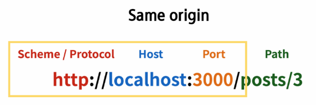

# Vue
## INDEX
- Vue with DRF
- CORS

## Vue with DRF
- Server와 Client의 통신 방법 이해하기
- CORS 이슈 이해하고 해결하기
- Vue와 API server 통신하기

### Server & Client
#### Server
- 클라이언트에게 정보와 서비스를 제공하는 컴퓨터 시스템
- 서비스 전체를 제공 == Django Web Service
  - Django를 통해 전달받은 HTML에는 하나의 웹 페이지를 구성할 수 있는 모든 데이터가 포함
  - 즉, 서버에서 모든 내용을 렌더링 하나의 HTML 파일로 제공
  - 정보를 포함한 web 서비스를 구성하는 모든 내용을 서버 측에서 제공
- 정보를 제공 == DRF API Service
  - Django를 통해 관리하는 정보만을 클라이언트에게 제공
  - DRF를 사용하여 JSON으로 변환

#### Client
- Server가 제공하는 서비스에 적절한 요청을 통해 Server로부터 반환받은 응답을 사용자에게 표현하는 기능을 가진 프로그램 혹은 시스템
- Server가 제공하는 서비스에 적절한 요청
  - Server가 정의한 방식대로 요청 인자를 넘겨 요청
  - Server는 정상적인 요청에 적합한 응답 제공
- Server로부터 반환받은 응답을 사용자에게 표현
  - 사용자의 요청에 적합한 data를 server에 요청하여 응답받은 결과로 적절한 화면을 구성

#### 정리
- Server는 정보와 서비스를 제공
  - DB와 통신하며 데이터를 생성, 조회, 수정, 삭제를 담당
  - 요청을 보낸 Client에게 정상적인 요청이었다면 처리한 결과를 응답
- Client는 사용자의 정보 요청을 처리, server에게 응답받은 정보를 표현
  - Server에게 정보(데이터)를 요청
  - 응답받은 정보를 가공하여 화면에 표현

-----------
## CORS(Cross-Origin Resource Sharing)
- 브라우저가 요청을 보내고 서버의 응답이 브라우저에 도착
  - Server의 log는 200(정상) 반환
  - 즉 Server는 정상적으로 응답했지만 브라우저가 막은 것
- 보안상의 이유로 브라우저는 동일 출처 정책(SOP)에 의해 다른 출처의 리소스와 상호작용하는 것을 제한 함

### SOP(Same-Origin Policy)
- 동일 출처 정책
- 불러온 문서나 스크립트가 다른 출처에서 가져온 리소스와 상호작용하는 것을 제한하는 보안 방식
- 잠재적으로 해로울 수 있는 문서를 분리함으로써 공격받을 수 있는 경로를 줄임

### Origin(출처)
- URL의 Protocol, Host, Port를 모두 포함하여 출처라고 부름
- Same Origin 예시
  - 아래 세 영역이 일치하는 경우에만 동일 출처로 인정


### CORS - 교차 출처 리소스 공유
- 추가 HTTP Header를 사용하여, 특정 출처에서 실행 중인 웹 어플리케이션이 다른 출처의 자원에 접근할 수 있는 권한을 부여하도록 브라우저에 알려주는 체제
  - 어떤 출처에서 자신의 컨텐츠를 불러갈 수 있는지 서버에 지정할 수 있는 방법
- 리소스가 자신의 출처와 다를 때 교차 출처 HTTP 요청을 실행
  - 만약 다른 출처의 리소스를 가져오기 위해서는 이를 제공하는 서버가 브라우저에게 다른 출처지만 접근해도 된다는 사실을 알려야 함
  - 교차 출처 리소스 공유 정책 (CORS policy)

### CORS policy - 교차 출처 리소스 공유 정책
- 다른 출처에서 온 리소스를 공유하는 것에 대한 정책
- CORS policy에 위배되는 경우 브라우저에서 해당 응답 결과를 사용하지 않음
  - Server에서 응답을 주더라도 브라우저에서 거절
- 다른 출처의 리소스를 불러오려면 그 출처에서 올바른 CORS header를 포함한 응답을 반환해야 함

### How to set CORS
- CORS 표준에 의해 추가된 HTTP Response Header를 통해 이를 통제 가능
- HTTP Response Header 예시
  - Access-Control-Allow-Origin/...
- Access-Control-Allow-Origin
  - 단일 출처를 지정하여 브라우저가 해당 출처가 리소스에 접근하도록 허용

#### django-cors-headers library 사용하기
- 응답에 CORS header를 추가해주는 라이브러리
- 다른 출처에서 Django 어플리케이션에 대한 브라우저 내 요청을 허용함
- 라이브러리 설치 및 requirements.txt 업데이트
```
$ pip install django-cors-headers

$ pip freeze > requirements.txt
```
- App 추가 및 MIDDLEWARE 추가
  - CorsMiddleware는 가능한 CommonMiddleware 보다 먼저 정의되어야 함
```python
# my_api/settings.py

INSTALLED_APPS = [
  ...,
  'corsheaders',
]

MIDDLEWARE = [
  ...,
  'corsheaders.middleware.CorsMiddleware',
  'django.middleware.common.CommonMiddleware'
]
```
- CORS_ALLOWED_ORIGIN에 교차 출처 자원 공유를 허용할 Domain 등록
```python
# my_api/settings.py

CORS_ALLOWED_ORIGINS = [
  'http://localhost:8080',
]
# 만약 모든 Origin을 허용하고자 한다면
# CORS_ALLOWED_ALL_ORIGINS = True
```