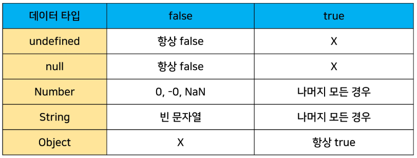

# Javascript
## INDEX
- JavaScript 시작하기
  - JavaScript란?
  - JavaScript Engine
  - JavaScript를 학습하기에 앞서
- JavaScript 기초 문법
  - 변수, 식별자
  - 데이터 유형
  - 연산자와 제어문
--------------
## JavaScript 시작하기
### JavaScript란?
- JavaScript는 클라이언트측 웹(브라우저)에서 실행
- 쉽게 배울 수 있고 강력한 스크립트 언어
- 웹페이지가 이벤트 발생 시 어떻게 작동하는 지 디자인/프로그래밍
- 웹 페이지 동작을 제어하는 데 널리 사용
- Web 기술의 기반이 되는 언어
  - HTML 문서의 콘텐츠를 동적으로 변경할 수 있는 언어
  - Web이라는 공간에서 채팅, 게임 등 다양한 동작을 할 수 있게 된 기반

### JavaScript Engine
#### 개요
- JavaScript Engine은 자바스크립트 코드를 실행하는 프로그램 또는 인터프리터
- 여러 목적으로 자바스크립트 엔진을 사용하지만, 대체적으로 웹 브라우저에서 사용

#### 웹 브라우저의 역할
- URL을 통해 Web(WWW)을 탐색함
- HTML/CSS/JavaScript를 이해한 뒤 해석해서 사용자에게 하나의 화면으로 보여줌
- 웹 서비스 이용 시 클라이언트의 역할을 함
- 즉, 웹 페이지 코드를 이해하고, 보여주는 역할을 하는 것이 바로 웹 브라우저

#### JavaScript Engine
- HTML/CSS/JavaScript를 이해한 뒤 해석
  - JavaScript를 해석하는 것이 JavaScript Engine의 역할
- 각 브라우저마다 자체 JavaScript Engine을 개발, 사용하고 있음
  - V8 - Chrome
  - Chakra - Microsoft Edge
  - JSC(JavaScript Core) - Apple(safari)
  - SpiderMonkey - FireFox
- 대체적으로 웹 브라우저에서 사용
- Node.js
  - Node.js는 V8 엔진을 사용하여 서버 측에서 자바스크립트 코드를 실행가능
  - 브라우저 조작 이외의 역할도 수행
----------
## JavaScript를 시작하기에 앞서
### EcmaScript
- ECMAScript란, Ecma International(전자 정보 통신 시스템 표준화 기구)이 ECMA-262 규격에 따라 정의하고 있는 표준화된 스크립트 프로그래밍 언어를 뜻함.
- 즉, JavaScript를 표준화하기 위해 만들어짐
- JavaScript의 기본적인 문법, 데이터 타입, 객체 모델, 함수, 연산자 등을 정의
  - 수업 시간에 작성하는 코드는 ES6+(2015년 이후) 정의된 내용을 토대로 진행

### 주석
- 한줄 주석(//), 여러줄 주석(/* */)

### 들여쓰기와 코드 블럭
- python은 4칸 들여쓰기를 사용했으나, JavaScript는 2칸 들여쓰기를 사용
- 블럭(block)은 if, for, 함수에서 중괄호{} 내부를 말함
  - python은 들여쓰기를 이용해서 코드 블럭을 구분
  - JavaScript는 중괄호{}를 사용해 코드 블럭을 구분

### 세미콜론(semicolon)
- 자바스크립트는 세미콜론을 선택적으로 사용 가능
- 세미콜론이 없으면 ASI에 의해 자동으로 세미콜론이 삽입됨
  - ASI(Automatic Semicolon Insertion, 자동 세미콜론 삽입 규칙)
- 본 수업에서는 자바스크립트의 문법 및 개념적 측면에 집중하기 위해 세미콜론을 사용하지 않고 진행
- 관련 논쟁
  - TC39(ECMAScript 기술 위원회)는 세미콜론 사용을 권장하는 분위기
  - 하지만 JavaScript 개발자는 세미콜론 사용을 반대
  - 세미콜론 사용 여부에 대해서는 여전히 논란이 많은 주제
  - 일관성 있게 회사/팀의 스타일 가이드에 맞춰서 사용하면 된다.
### 코드 스타일 가이드
- python에도 PEP8이라는 코드 스타일 가이드가 있었듯, JavaScript에도 코드 스타일 가이드가 존재
- 다만 JavaScript는 여러 코드 스타일 가이드가 회사마다 존재하는데, 수업에서는 Airbnb style Guide를 기반으로 사용할 것
  - 단, 가이드의 일부 항목은 문법 및 개념적 측면에 집중하기 위해 변형해서 사용하는 경우 있음
-----------
## JavaScript 기초 문법
### 변수와 식별자
#### 식별자 정의와 특징
- 식별자(identifier)는 변수를 구분할 수 있는 변수명을 말함
- 식별자는 반드시 문자, 달러 또는 밑줄로 시작
- 대소문자를 구분하며, 클래스명 외에는 모두 소문자로 시작
- 예약어 사용 불가능
  - ex) for, if, function 등
- 카멜 케이스
  - camelCase
  - 변수, 객체, 함수에 사용
- 파스칼케이스
  - PascalCase
  - 클래스, 생성자에 사용
- 대문자 스네이크 케이스
  - SNAKE_CASE
  - 상수에 사용

#### 선언, 할당 초기화
- 선언(Declaration)
  - 변수를 생성하는 행위 또는 시점
- 할당(Assignment)
  - 선언된 변수에 값을 저장하는 행위 또는 시점
- 초기화(Initialization)
  - 선언된 변수에 처음으로 값을 저장하는 행위 또는 시점

#### 블록 스코프
- if, for, 함수 등의 중괄호{} 내부를 가리킴
- 블록 스코프를 가지는 변수는 블록 바깥에서 접근 불가능

#### 변수 선언 키워드
- python과 다르게 JavaScript는 변수를 선언하는 키워드가 정해져 있음
- let
  - 블록 스코프 지역 변수를 선언(추가로 동시에 값을 초기화)
  - 재할당 가능 & 재선언 불가능
  - 블록 스코프를 갖는 지역 변수를 선언, 선언과 동시에 원하는 값으로 초기화할 수 있음
- const
  - 블록 스코프 읽기 전용 상수를 선언(추가로 동시에 값을 초기화)
  - 재할당 불가능 & 재선언 불가능
  - 선언 시 반드시 초기값을 설정 해야 하며, 이후 값 변경이 불가능
  - let과 동일하게 블록 스코프를 가짐
- var
  - 변수를 선언(추가로 동시에 값을 초기화)
  - 재할당 가능 & 재선언 가능
  - ES6 이전에 변수를 선언할 때 사용되던 키워드
  - "호이스팅"되는 특성으로 인해 예기치 못한 문제 발생 가능
    - 따라서 ES6 이후부터는 var 대신 const와 let을 사용하는 것을 권장
  - 함수 스코프를 가짐
  - 변수 선언시 var, const, let 키워드 중 하나를 사용하지 않으면 자동으로 var로 선언됨

#### 호이스팅
- 변수를 선언 이전에 참조할 수 있는 현상
- var로 선언된 변수는 선언 이전에 참조할 수 있으며, 이러한 현상을 호이스팅이라 함
- 변수를 선언하기 전에 접근이 가능한 것은 코드의 논리적인 흐름을 깨뜨리는 행위이며 이러한 것을 방지하기 위해 let, const가 추가되었음
  - 즉, var는 사용하지 않아야 하는 키워드
- 다만, 아직까지도 많은 기존의 JavaScript 코드는 ES6 이전의 문법으로 작성되어 있으므로 호이스팅에 대한 이해가 필요

### 데이터 타입
- JavaScript의 모든 값은 특정한 데이터 타입을 가짐
- 크게 원시 타입(Primitive type)과 참조 타입(Reference type)으로 분류됨


#### 원시 타입(Primitive type)

**Number** 
- 정수 또는 실수형 숫자를 표현하는 자료형
- NaN을 반환하는 경우
  - 숫자로 읽을 수 없음
  - 결과가 허수인 수학 계산식
  - 피연산자가 NaN
  - 정의할 수 없는 계산식
  - 문자열을 포함하면서 덧셈이 아닌 계산식

**String**
- 문자열을 표현하는 자료형
- 작은 따옴표 또는 큰 따옴표 모두 가능
- 곱셈, 나눗셈, 뺄셈은 안되지만 덧셈을 통해 문자열끼리 붙일 수 있음
- 따옴표를 사용하면 선언 시 줄 바꿈 불가능
- 대신 escape sequence를 사용할 수 있기 때문에 \n를 사용
- Template Literal을 사용하면 줄 바꿈이 가능, 문자열 사이에 변수도 삽입 가능
- Template Literal
  - 내장된 표현식을 허용하는 문자열 작성 방식
  - ES6+ 부터 지원
  - Backtick(``)을 이용하며, 여러 줄에 걸쳐 문자열을 정의할 수도 있고 JavaScript의 변수를 문자열 안에 바로 연결할 수 있는 이점이 생김
  - 표현식을 넣을 수 있는데, 이는 $와 중괄호(${expression})로 표기

**Empty Value**
- 값이 존재하지 않음을 표현하는 값으로 JavaScript에서는 null과 undefined가 존재
- 동일한 역할을 하는 이 두개의 키워드가 존재하는 이유는 단순한 JavaScript의 설계 실수
- null
  - null 값을 나타내는 특별한 키워드
  - 변수의 값이 없음을 의도적으로 표현할 때 사용
- undefined
  - 값이 정의되어 있지 않음을 표현하는 값
  - 변수 선언 이후 직접 값을 할당하지 않으면 자동으로 할당됨
- null과 undefined의 가장 대표적인 차이점은 typeof 연산자를 통해 타입을 확인했을 때 나타남
- null이 원시 타입임에도 불구하고 object로 출력되는 이유는 JavaScript 설계 당시의 버그를 지금까지 해결하지 못한 것
- 쉽게 해결할 수 없는 이유는 이미 null 타입에 의존성을 띄고 있는 많은 프로그램들이 망가질 수 있기 때문(하위 호환 유지)

**Boolean**
- true와 false
- 참과 거짓을 표현하는 값
- 조건문과 반복문에서 유용하게 사용
  - 조건문 또는 반복문에서 boolean이 아닌 데이터 타입은 자동 형변환 규칙에 따라 true 또는 false로 변환됨

#### 참조 타입(Reference type)

**객체(object)**
- 객체는 속성의 집합이며, 중괄호 내부에 key와 value의 쌍으로 표현
- key
  - 문자열 타입만 가능
  - key 이름에 띄어쓰기 등의 구분자가 있으면 따옴표로 묶어서 표현
- value
  - 모든 타입(함수포함) 가능
- 객체 요소 접근
  - 점(.) 또는 대괄호([])로 가능
  - key 이름에 띄어쓰기 같은 구분자가 있으면 대괄호 접근만 가능

**배열(Array)**
- 키와 속성들을 담고 있는 참조 타입의 객체
- 순서를 보장하는 특징이 있음
- 주로 대괄호([])를 이용하여 생성하고, 0을 포함한 양의 정수 인덱스로 특정 값에 접근 가능
- 배열의 길이는 array.length 형태로 접근 가능
  - 배열의 마지막 원소는 array.length-1 로 접근

**함수(Function)**
- 참조 타입 중 하나로써 function 타입에 속함
- JavaScript에서 함수를 정의하는 방법은 주로 2가지로 구분됨
  - 함수 선언식(function declaration)
  - 함수 표현식(function expression)
- 함수 선언식
  - 일반적인 프로그래밍 언어의 함수 정의 방식
  ```javascript
  function add(num1, num2){
    return num1 + num2
  }
  add(2, 7) // 9
  ```
- 함수 표현식
  - 표현식 내에서 함수를 정의하는 방식
  - 함수 표현식은 함수의 이름을 생략한 익명 함수로 정의 가능
  ```javascript
  const sub = function(num1, num2){
    return num1 - num2
  }
  sub(7, 2) // 5
  ```
  - 표현식에서 함수 이름을 명시하는 것도 가능
  - 다만 이 경우 함수 이름은 호출에 사용되지 못하고 디버깅 용도로 사용됨
  ```javascript
  const mySub = function namedSub(num1, num2){
    return num1 - num2
  }
  mySub(1, 2) // -1
  namedSub(1, 2) // ReferenceError: namedSub is not defined
  ```

#### ToBoolean Conversions(자동 형변환)


### 연산자
#### 할당 연산자
- 오른쪽에 있는 피연산자의 평가 결과를 왼쪽 피연산자에 할당하는 연산자
- 다양한 연산에 대한 단축 연산자 지원
- Increment 및 Decrement 연산자
  - Increment(++): 피연산자의 값을 1 증가시키는 연산자
  - Decrement(--): 피연산자의 값을 1 감소시키는 연산자
  - += 또는 -=과 같이 더 분명한 표현으로 적을 것을 권장

#### 비교 연산자
- 피연산자들(숫자, 문자, Boolean 등)을 비교하고 결과값을 boolean으로 반환하는 연산자
- 문자열으 ㄴ유니코드 값을 사용하며 표준 사전 순서를 기반으로 비교
  - ex) 알파벳끼리 비교할 경우
    - 알파벳 순서상 후순위가 더 크다
    - 소문자가 대문자보다 더 크다

#### 동등 연산자(==)
- 두 피연산자가 같은 값으로 평가되는지 비교 후 boolean 값을 반환
- 비교할 때 암묵적 타입 변환 통해 타입을 일치시킨 후 같은 값인지 비교
- 두 피연산자가 모두 객체일 경우 메모리의 같은 객체를 바라보는지 판별
- 예상치 못한 결과가 발생할 수 있으므로 특별한 경우를 제외하고 사용하지 않음

#### 일치연산자(===)
- 두 피연산자의 값과 타입이 모두 같은 경우 true를 반환
- 같은 객체를 가리키거나, 같은 타입이면서 같은 값인지를 비교
- 엄격한 비교가 이뤄지며 암묵적 타입 변환이 발생하지 않음
  - 엄격한 비교 : 두 비교 대상의 타입과 값 모두 같은 지 비교하는 방식

#### 논리 연산자
- 세 가지 논리 연산자로 구성
  - and(&&)
  - or(||)
  - not(!)
- 단축 평가 지원

#### 삼항 연산자(Ternary Operator)
- 3개의 피연산자를 사용하여 조건에 따라 값을 반환하는 연산자
- 가장 앞의 조건식이 참이면 콜론(:) 앞의 값이 반환되며, 그 반대일 경우 콜론 뒤의 값이 반환되는 연산자
- 삼항 연산자의 결과 값이기 때문에 변수에 할당 가능
```javascript
true ? 1:2 // 1
false ? 1:2 // 2
```

#### 스프레드 연산자(Spread Operator)
- 배열이나 객체를 전개하여 각 요소를 개별적인 값으로 분리하는 연산자
- 주로 함수 호출 시 매개변수로 배열이나 객체를 전달할 때 사용
- 얕은 복사를 위해서도 활용 가능
```javascript
const numbers = [1, 2, 3]
const otherNumbers = [...numbers, 4, 5] // [1, 2, 3, 4, 5]
const copyNumbers = [...numbers] // [1, 2, 3]

const obj = {a:1, b:2}
const otherObj = {c:3, ...obj} // {a:1, b:2, c:3}
const copyObj = {...obj} // {a:1, b:2}
```

### 조건문
#### if statement
- if, else if, else
  - 조건은 소괄호안에 작성
  - 실행할 코드는 중괄호 안에 작성
  - 블록 스코프 생성

### 반복문
#### while
- 조건이 참이기만 하면 문장을 계속해서 수행
```javascript
let i = 0
while(i<6){
  console.log(i)
  i += 1
} // 0, 1, 2, 3, 4, 5
```

#### for
- 특정한 조건이 거짓으로 판별될 때까지 반복
```javascript
for(let i=0;i<6;i++){
  console.log(i)
} // 0, 1, 2, 3, 4, 5
```

#### for...in
- 객체의 속성을 순회할 때 사용(속성 이름을 통해 반복)
- 배열도 순회 가능하지만 인덱스 순으로 순회한다는 보장이 없으므로 권장하지 않음
```javascript
const fruits = {a:'apple', b:'banana'}
for(const key in fruits){
  console.log(key) // a, b
  console.log(fruits[key]) // apple, banana
}
```

#### for...of
- 반복 가능한 객체를 순회할 때 사용(속성 값을 통해 반복)
- 반복 가능한 객체의 종류 : Array, Set, String 등
```javascript
const numbers = [0, 1, 2, 3]
for(const number of numbers){
  console.log(number) // 0, 1, 2, 3
}
```

#### for과 const
- for문
  - 최초 정의한 i를 재할당하면서 사용하기 때문에 const를 사용하면 에러 발생
- for...in, for...of
  - 재할당이 아니라, 매 반복 시 해당 변수를 새로 정의하여 사용하므로 에러가 발생하지 않음

#### Array.forEach()
- 배열의 메서드들 중 하나
```javascript
const numbers = [1, 2, 3]
numbers.forEach(function(element){
  console.log(element)
}) // 1, 2, 3
```


## optional chaining
```javascript
const obj = {
  a:1
}
console.log(obj.a.value) // undefined
console.log(obj.b.value) // error
console.log(obj.b?.value) // undefined > ? 이전이 undefined이면 이후를 무시

const a = obj.b?.value ?? 'hoho' // 앞이 undefined 이면 'hoho'를 default로
```